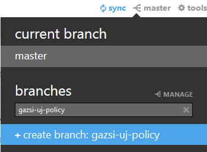

MiracleWorkers
==============

---------------------------------------

Commit policy
-------------

Mielőtt egy új feature fejlesztésébe kezdesz mindig szinkronizáld le a változtatásokat GitHub-ról. Ha ez megvan hozz létre egy új branch-et `nev-feature-leirasa` névvel (pl. `gazsi-uj-policy`), értelemszerűen ékezetek nélkül. A branch-eket időnként majd merge-elem a masterbe.

Mentés előtt mindenki nyomjon egy Organize Imports-ot (Ctrl+Shift+O) és egy Format Code-ot (Ctrl+Shift+F). A formázási beállításokat beraktam a repo-ba (`policy/codestyle.xml`), azt mindenki importolja magának és így nem lesznek eltérések.

A fejlesztés közben párszor kommitoljatok, inkább többet mint kevesebbet. A commit üzenet sablonja a következő:

    Egysoros rövid összefoglaló a commit-ról

    Commit hosszabb leírása, az esetleges kommentek és felmerülő kérdések...

    Munkaidő: ... óra

Egyéb
-----

A repon belülre bármit beraktok külön mappában legyen ha sehova sem tartozik. Így nem fognak keveredni a projektek és a fájlok.
